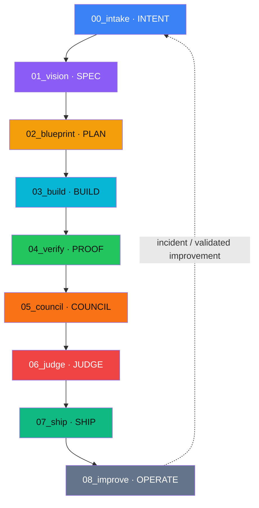

# Vibe Engineering Architecture Map

This workspace inherits the Vibe Engineering house architecture.

```text
VIBE ENGINEERING
Governance / release law
        ↓
ICM
Interpretable context + stage contracts
        ↓
INTENT → SPEC → PLAN → BUILD → PROOF → COUNCIL → JUDGE → SHIP → OPERATE
        ↓
ORCHESTRATOR
Routes approved work between stages
        ↓
WORKERS
Replaceable implementation agents
        ↓
GIT + CI + EVIDENCE + ROLLBACK
Durable proof and owner control
```

## Current physical stage mapping



The canonical token definitions live in `_config/stage-system.yaml`. Text labels remain authoritative; color is a supplemental visual signal.
